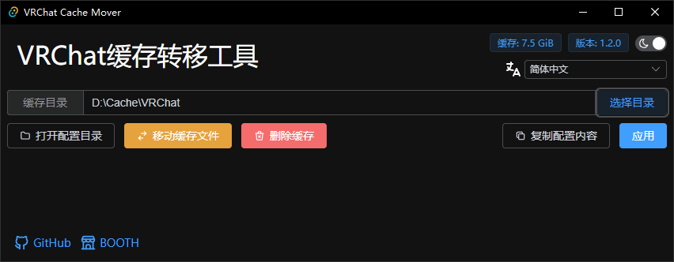
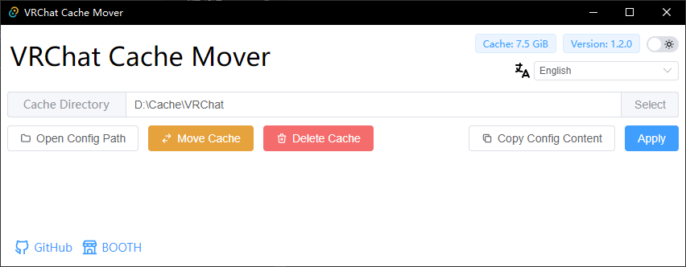

# VRChat 缓存转移工具

将 VRChat 缓存移动到指定目录的小工具.

拥有相对现代并且易用的 UI.

要了解如何安装和使用, 参见[安装及使用](#安装及使用)

### 简单

理论上只需要点击一次按钮即可完成修改, 不需要你打开那可怕的命令行.

操作完成你就可以把工具删除了.

顺便一提, 工具支持了四门语言和暗色模式.

### 安全

完全开源, 发布的版本都是使用[Action](https://github.com/gizmo-ds/vrchat-cache-mover/blob/main/.github/workflows/release.yml)编译的.

通过修改[VRChat 配置文件](https://docs.vrchat.com/docs/configuration-file#cache-settings)实现功能, 不会出现`NTFS符号链接`的一堆错误.

### 交流

- 企鹅群 324617456

### 许可

VRChat Cache Mover 使用 [AGPL-3.0 license](https://opensource.org/licenses/AGPL-3.0) 许可证书.

## 安装及使用

### 依赖的运行环境

VRChat Cache Mover 依赖 WebView2 呈现内容, 因此你需要安装 WebView2 才能使用本工具.

最简单的安装方法是到[Microsoft 官网](https://developer.microsoft.com/zh-cn/microsoft-edge/webview2/#download-section)下载并安装 `常青版引导程序`.

::: info
WebView2 已经预装在 Windows 11 中.
:::

### 下载 VRChat Cache Mover

你可以点击下面的按钮下载到最新版本的工具, 也可以通过[GitHub Releases](https://github.com/gizmo-ds/vrchat-cache-mover/releases/latest)下载预编译的文件.

<ClientOnly>
  <download repo="gizmo-ds/vrchat-cache-mover"/>
</ClientOnly>

你将会得到一个压缩文件, 将它解压, 并运行其中的 `vrchat-cache-mover.exe`.

### 修改缓存目录

如果一切正常, 你应该正常打开工具了.
在工具的右上角此时能看到工具的版本号和 VRChat 的缓存吃掉了你多少的磁盘空间.

1. 点击 `选择目录` 按钮, 选择你需要将缓存转移到的目标位置.  顺便一提, 你也可以直接把文件夹拖到窗口里.
2. 点击 `应用` 按钮.
3. 完成

> 如果你想的话, 你也可以复制配置内容, 将内容粘贴到配置目录下的 `config.json` 文件 😂

### 转移或删除缓存

::: danger
如果你曾经使用过`mklink`命令或其他的工具, 请跳过此步骤.

也建议您点击工具的 `打开配置目录` 按钮并删除 `Cache-WindowsPlayer` 文件夹.
:::

确保你已经选择了`缓存目录`, 点击 `移动缓存文件` 按钮或者 `删除缓存` 按钮, 等待右下角弹窗提示成功即可.

很简单不是么 🐱

### 修改缓存有效期和缓存大小

::: info
非特殊需求不是很建议修改, 默认的设置挺合理的.
:::

- 缓存有效期: 默认 30 天, 单个缓存文件在 30 天内没被再次访问就会被删除.
- 缓存大小: 默认 20 GB, 缓存文件夹的最大上限, 可能会因为单个缓存的大小高于或低于设定的值.

## 网页版本

::: info
网页版本目前仅支持 Chrome 以及部分 Chromium 魔改的浏览器(如 Edge)
:::

由于浏览器 API 的限制, 仅支持修改配置, 转移或删除缓存功能请使用软件版本.

[网页版链接](https://vrchat-cache-mover-web.vercel.app/)

1. 在 `缓存目录` 输入你要转移到的位置, 建议使用复制粘贴的方式.
2. 使用快捷键 `Win+R` 打开运行窗口, 输入 `cmd` 或 `powershell` 打开终端.
3. 在终端中输入 `whoami` 并按下 `Enter`(回车键), 将结果复制到 `当前用户名` 中.
4. 点击 `复制路径` 按钮.
5. 点击 `打开配置文件` 按钮, 在选择文件夹弹窗的 `文件名` 处粘贴刚刚复制的路径, 点击打开.
   - 如果提示文件不存在, 点击确定然后把选择文件夹弹窗关闭. 点击 `保存配置文件` 按钮, 在弹出的另存为弹窗的 `文件名` 处粘贴刚刚复制的路径, 点击保存.
   - 如果没有提示文件不存在. 点击 `保存配置文件` 按钮, 会弹出 `将修改保存至 config.json?` 的弹窗, 点击 `保存修改`.
6. 完成

## 常见问题

- 转移缓存后系统盘依然占用了大量空间.

  `移动缓存文件` 功能可能会耗时较长, 你需要等待右下角提示成功后才可以关闭工具.
